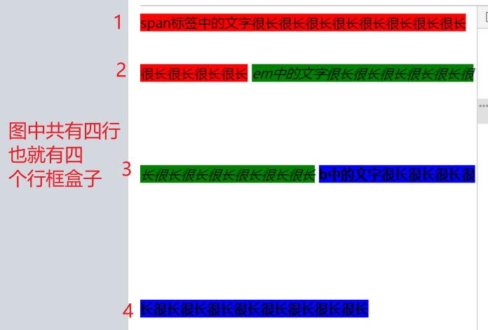

### 行内元素

- 行内元素的高度只由行高决定! 所以它的 padding / border / margin 等属性不影响它的高度 自然也就不会影响布局
- 行高的特点有
  - 可继承
  - 默认值为 normal 相当于 1.3 意思是 1.3 \* font-size 的值 而 font-size 也有默认值 所以即使不设置行高和 font-size
    行内元素也是有高度的

## vertical-align 与 行内元素 和 行内块 元素垂直方向上的对齐

### 行框盒子

- 由 行内元素 和 行内块元素 组成的一行就是行框盒子
  
- 需要特别特别注意的就是 在行框盒子的最前面有一个幽灵空白节点 该节点继承父元素的所有可继承属性
  最重要的属性就是父元素的行高 它虽然没有任何内容 但是它会产生跟有内容一样的影响
  **所以将幽灵空白节点统一看成是一个小写的 x**

### 各元素基线及上/下边界的定义

- 行框盒子
  - 基线: 根据内部规则动态决定
  - 上 / 下边界:根据内部规则动态决定

- 行内元素
  - 基线: _写字母 x 的下边缘_
  - 上/下边界: _当前元素高度的边界_

- 行内块
  - 基线:_(当有内联 或 内联块子元素) 且 (overflow:visible) 的话 就是内部最后一个行框盒子的基线 否则就是当前元素 margin-box 的下边界_
  - 上 / 下边界:_即其 margin-box 的上/下边界_

### vertical-align 可设置的值及解释

- baseLine: 用行内 / 行内块自己的基线去对齐行框盒子的基线
- top / bottom : 用自己的上/下边界去对齐行框盒子的上/下边界
- middle: 用 行内 / 行内块 自己的中边界 与 行框盒子的基线往上移 1/2 x-height 对齐
**注意:父元素的vertical-align不会影响子元素内部的对齐**

### 基线内联盒子
- 为了方便描述基线的位置 引入基线内联盒子的定义: 
  写在该盒子里面 且行高为该盒子高度的小x的下边界即是行框盒子的基线 要确认基线的位置就必须知道 
  1:基线内联盒子的位置 2:高度 
 **基线内联盒子和行框盒子的高度关系是: 基线盒子是在行框盒子内部的 所以它的高度 <= 行框盒子的高度**

# 分类讨论各情况下vertical-align怎么运作

## 当父元素设置 line-height而不设置height
需要确定的有三个
- 1: 基线内联盒子的位置 2:基线内联盒子的高度 在基线内联盒子里面写个小x 小x的下边界就是行框盒子的基线 **值为baseline middle 时需要用到**
- 2: 行框盒子的高度 知道了高度就能知道它的上 / 下边界  **值为 top / bottom 时需要用到**
- 3: 当只有一行时 行框盒子高度就是父元素的高度

### 当行框盒子内只有行内时

- 基线内联盒子位置: 和行框盒子上边界对齐
- 基线内联盒子高度: Math.max(父元素的line-height**由于幽灵空白节点的存在**,_所有baseline的行内块的line-height_)

- 行框盒子高度: Math.max(父元素的line-height,所有子元素的line-height)

### 当里面含有一个行内块时
- 注意点:
  - **因为有幽灵空白节点的存在 所以一定会有至少一个行内元素**
  - **下面的行内块高度表示的是 行内块基线到行内块margin-box上边界的距离**

- 特殊情况: 当行内块的vertical-align值为baseline时 行内块基线就是行基线 先看行框盒子的高度

  - 行框盒子高度: 下面情况中选最大
    1: (行内块高度 + 1/2 * 父元素和**设置为baseline的行内**的line-height中取最大) 
    2: 当 **设置为baseline的行内最大line-height** * 4/7 > 行内块高度时 取该最大line-height
    3: 当 **设置为 top / bottom / middle 的行内最大line-height** > 情况1的高度时 取该最大line-height
  **总结 当line-height都不是很大时 第一种情况 都存在很大的为baseline时 看第二种 当存在很大的为非baseline时 看第三种**

  - 高度为情况1时 行框盒子和基线内联盒子下边界对齐 高度为 Math.max(父,**baseline的行内**) 
  - 高度为情况2 和 情况3时 行框盒子就是基线内联盒子!!!

- 当行内块为 top / middle / bottom时

  - 行框盒子高度: Math.max(行内块的margin-box高度,父和**所有行内**的line-height)

  - 基线内联盒子的位置:
    - top: 基线内联盒子与行框盒子的上边界对齐

    - bottom: 基线内联盒子与行框盒子的上边界对齐

    - middle: 基线内联盒子与行框盒子的中边界对齐 

   - 基线内联盒子的高度: Math.max(父,**baseline的行内**)

### 当含有多个行内块时 (不允许有 line-height > 父元素高度)
- 特殊情况: 如果存在baseline的行内块 **这种情况太复杂了 不讨论**

- 行内块都是非baseline: 
  - 行框盒子高度: 所有行内块的盒子高度中取最大

  - 基线内联盒子的位置: 决定高度的行内块的vertical-align为何值?
    - top: 基线内联盒子与行框盒子的上边界对齐

    - bottom: 基线内联盒子与行框盒子的上边界对齐

    - middle: 基线内联盒子与行框盒子的中边界对齐 

  - 基线内联盒子的高度: Math.max(父,**baseline的行内**) 

## 当父元素设置 height 而不设置 line-height (所有行内块的盒子高度和所有line-height都必须小于 父元素的高度 )
**需要配合伪元素使用**
- 这时候不需要再看父元素的line-height了

- 如果没baseline的话 或者 为baseline的**最大行内块高度 * 1/2** > height 的话
  因为高度最大的就是伪元素 所以基线内联盒子就是行框盒子

- 如果为baseline的**最大行内块高度 * 1/2** > height 的话 那么该最大行内块的盒子上边界与行框上边界重合
且其基线就是行框基线

## 嵌套的行内块
- 外面嵌套的元素只设置 display:inline-block vertical-aling看情况设置
- 外面怎么影响里面?
  - 外面的基线就是内部的基线 所以里面的元素设置 baseline / middle这样的跟基线有关的效果跟外面的相同
    而 top / bottom 这样的依赖行框的 而内外有不是同个行框 所以需要对里面的行框单独分析

    如果想实现内部元素的 top / bottom相对的是外面的大盒子的话 需要给包裹的行内块和内部行内块同时设置 top / bottom

- 如果里面有多个元素 而且想要一个对齐外面的 top 一个对齐外面的bottom呢? 
  - 注意不能通过将包裹的行内块设置为 height:100% 因为在无特殊处理的情况下 父元素的高度不会影响行框的高度 

  - 这种情况必须手动设置里面的行内块高度以撑起行框高度 然后包裹的其他行内块在该行框高度下进行 top / bottom
    **注意如果手动设置里面为baseline的行内块的height 超过 外面的1/2的话 根据上面的规则 外部的基线会被改变**

- 所以外部对内部的影响是 行框基线为外部的行框基线 内部对外部的影响是 手动设置baseline的height超过 1/2 父元素的高度会改变外部基线
    

  

